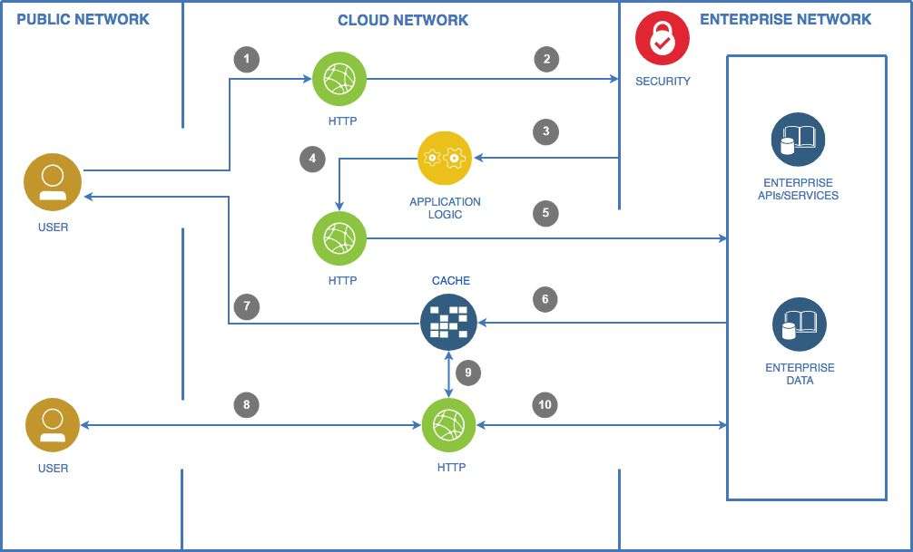

# Digest Authentication with IBM Integration Bus/App Connect

In this Code Pattern, we will learn how to build a service in IBM integration bus which can be exposed as a proxy to achieve digest authentication. We will learn how the digest authentication mechanism works in background and what logic needs to be built for a platform which doesn’t support digest authentication of its own. We will also learn how to expose the IIB service on a IBM cloud Kubernetes cluster and consume it via a sample client. Entire façade application and client application is built on IBM integration bus and deployed on Kubernetes node using a Docker image. 

When the reader has completed this code pattern, they will understand how to:
* Create a message flow and build logic for digest Authentication
* Deploy and test application locally 
* Deploy and test application expose the IIB service to Kubernetes

## Flow Diagram

## Flow
1. User sends request to application. 
2. Application sends request to server seeking authorisation.
3. Request is rejected by the server asking for an authorisation and server responds with the details to create authorisation.
4. Application builds authorisation logic.
5. Application sends another request to server seeking authorisation. 
6. Request is successfully authorised. 
7. Application saves authorisation header or cookies in cache for next http request and respond with success.
8. User sends request to application.
9. Application sends request with cached data to server seeking authorisation.
10. Server authorises users.    
11. Success response sent back to user

## Included components
* [IBM Cloud](https://www.ibm.com/cloud/): IBM Cloud is a suite of cloud computing services from IBM that offers both platform as a service (PaaS) and infrastructure as a service (IaaS). With IBM Cloud IaaS, organizations can deploy and access virtualized IT resources.
* [Docker](https://www.docker.com/): Docker provides container software that is ideal for developers and teams looking to get started and experimenting with container-based applications. 
* [Kubernetes](https://kubernetes.io/): Kubernetes is an open-source container-orchestration system for automating deployment, scaling and management of containerized applications.
* [SoapUI](https://www.soapui.org/): SoapUI is an open-source web service testing application for service-oriented architectures and representational state transfers. 

## Featured technologies
* [IBM Integration bus](https://www.ibm.com/support/knowledgecenter/en/SSMKHH_10.0.0/com.ibm.etools.msgbroker.helphome.doc/help_home_msgbroker.htm): IIB allows business information to flow between disparate applications across multiple hardware and software platforms. Rules can be applied to the data flowing through the message broker to route and transform the information IIB provides access to various inbuilt nodes which provide ready to use capability.
* [Digest Authentication](https://en.wikipedia.org/wiki/Digest_access_authentication): Digest access authentication is one of the agreed-upon methods a web server can use to negotiate credentials, such as username or password, with a user's web browser. This can be used to confirm the identity of a user before sending sensitive information, such as online banking transaction history.

# Watch the Video

To-be-included

## Prerequisites:
* Access to IBM cloud tools: To interact with IBM cloud, the IBM Cloud CLI will need to be installed beforehand. Please follow steps in below link to setup your IBM cloud tools.
https://console.bluemix.net/docs/containers/cs_cli_install.html#cs_cli_install

* IBM Integration Bus toolkit: In this code pattern we will use IIB toolkit version 10.0.0.9 to demo the logic and implementation. This logic can be implemented by any development tool available to you. 

# Steps
1.	[Create Service](#1-create-service)
2.	[Deploy service locally and test ] (#2 Deploy service locally and test) 
3.	Create Kubernetes cluster and deploy on IBM cloud
4.	Test API on Cloud

### 1. Create Service
Main message flow
This is the main flow where request is received at Http Input node and once the transaction is complete it responds by the HTTP reply node.

### 2. Deploy service locally and test 

